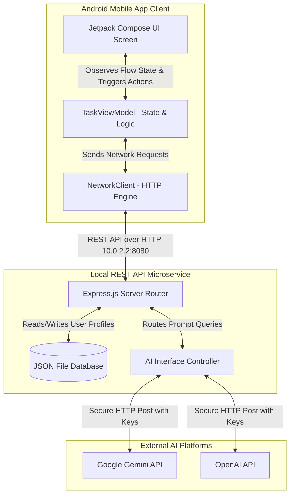

# 📐 MindfulTasks - Architecture & Technical Specification

This document details the High-Level (HLD) and Low-Level (LLD) architecture of the **MindfulTasks** application (V2.0). It covers data flows, component design, network communication protocols, and security parameters to ensure a compliant, robust implementation.

---

## 🗺️ Part 1: High-Level Architecture (HLD)

MindfulTasks is designed as a self-contained, clean-boundary mobile application connected to a local backend microservice. It utilizes a **Client-Server Architecture** with a clear separation of concerns.



### 1. Component Descriptions
* **Android Client**: A native Android app written in Kotlin. It handles the rendering, local input validation, and user sessions.
* **Backend Microservice**: A Node.js server powered by Express.js. It acts as the single source of truth for user accounts and filters traffic.
* **JSON File Database**: A self-contained database system (`users.json`) stored on disk within the server. It stores usernames, hashed passwords, and personal items.
* **AI Router**: An internal microservice handler that safely delegates user chat messages to OpenAI or Google Gemini without exposing credentials to the client.

### 2. Network Communication
* **Protocol**: HTTP/1.1 RESTful APIs.
* **Payload Format**: JSON (Application/JSON).
* **Base URL**: `http://10.0.2.2:8080` (A special loopback IP that allows the Android Emulator to connect directly to the Mac host computer).

---

## 🔍 Part 2: Low-Level Architecture (LLD)

### 1. Frontend Client Architecture (Android App)

The app follows the official Google architecture guidelines: **Model-View-ViewModel (MVVM)**.

```
+--------------------------------------------------+
|                    UI View                       |
|  (MainActivity.kt, TaskScreen.kt, AuthScreen.kt)  |
+------------------------+-------------------------+
                         | Observes Flow State
                         v
+--------------------------------------------------+
|                   ViewModel                      |
|              (TaskViewModel.kt)                  |
+------------------------+-------------------------+
                         | Calls HTTP Methods
                         v
+--------------------------------------------------+
|                 Network Layer                    |
|              (NetworkClient.kt)                  |
+--------------------------------------------------+
```

#### **A. Data Models (Models)**
```kotlin
// Represents a single task item
data class Task(
    val id: String,
    val title: String,
    val isCompleted: Boolean,
    val priority: Priority,
    val category: String
)

// Represents a journal reflection log
data class JournalEntry(
    val id: String,
    val text: String,
    val date: String,
    val moodEmoji: String
)

// Represents a message in the Zen AI chat room
data class ChatMessage(
    val text: String,
    val isUser: Boolean,
    val timestamp: String
)
```

#### **B. ViewModel API Properties & Methods (ViewModel)**
* **State Flows (Exposes Live Feeds)**:
  * `tasks: StateFlow<List<Task>>`
  * `journalEntries: StateFlow<List<JournalEntry>>`
  * `chatMessages: StateFlow<List<ChatMessage>>`
  * `currentUser: StateFlow<String?>` (Holds the logged-in username)
  * `selectedAiModel: StateFlow<String>` (Either "gemini" or "chatgpt")
* **Command Methods**:
  * `loginUser(username, password)` ➔ Calls `/api/auth/login`
  * `registerUser(username, password)` ➔ Calls `/api/auth/signup`
  * `addTask(title, priority, category)` ➔ Calls `POST /api/tasks`
  * `toggleTask(taskId)` ➔ Updates local status and calls `POST /api/tasks`
  * `deleteTask(taskId)` ➔ Calls `DELETE /api/tasks`
  * `sendAiQuery(message)` ➔ Calls `POST /api/ai/query` and appends the response to `chatMessages`.

---

### 2. Backend Server Architecture (Node.js Microservice)

The backend server is structured inside `/Users/developer/Documents/AG2.0/backend-service`.

#### **A. REST API Specifications**
| Endpoint | Method | Payload | Response | Description |
| :--- | :--- | :--- | :--- | :--- |
| `/api/auth/signup` | POST | `{ "username": "...", "password": "..." }` | `{ "success": true, "message": "..." }` | Registers a new account. |
| `/api/auth/login` | POST | `{ "username": "...", "password": "..." }` | `{ "success": true, "username": "..." }` | Authenticates user. |
| `/api/tasks` | GET | Query param: `?username=...` | `[ { "id": "...", "title": "..." } ]` | Fetches tasks for a specific user. |
| `/api/tasks` | POST | `{ "username": "...", "tasks": [...] }` | `{ "success": true }` | Overwrites task list database for a user. |
| `/api/journal` | GET | Query param: `?username=...` | `[ { "id": "...", "text": "..." } ]` | Fetches journal logs for a specific user. |
| `/api/journal` | POST | `{ "username": "...", "journal": [...] }` | `{ "success": true }` | Overwrites journal list database for a user. |
| `/api/ai/query` | POST | `{ "query": "...", "model": "gemini|chatgpt" }` | `{ "response": "..." }` | Routes AI queries to Gemini/ChatGPT. |

#### **B. Database Layout (`users.json`)**
The JSON database is formatted as a key-value dictionary where the `username` is the unique key:
```json
{
  "Anand-D1989": {
    "password": "hashed_password_here",
    "tasks": [
      { "id": "1", "title": "Morning Meditation", "isCompleted": true, "priority": "HIGH", "category": "Mind" }
    ],
    "journal": [
      { "id": "j1", "text": "Zen day...", "date": "May 26, 2026", "moodEmoji": "🧘" }
    ]
  }
}
```

---

## 🔒 Part 3: Security & Verification Parameters

### 1. Data Security
* **Authentication**: Password checks prevent unauthorized database reading.
* **Credentials safety**: API keys for external platforms (Gemini/OpenAI) are stored inside a `.env` file on the Mac host computer and are never compiled into the mobile `.apk` code. This prevents reverse-engineering of keys.

### 2. Error Mitigation & Demo Mode
If the server cannot access the internet (or lacks API keys), the **AI Router** will enter a mock response state. It responds with intelligent, zen-themed answers matching the selected personality:
* **Gemini (Google)**: Reflective, logical, and structured.
* **ChatGPT (OpenAI)**: Friendly, conversational, and direct.
