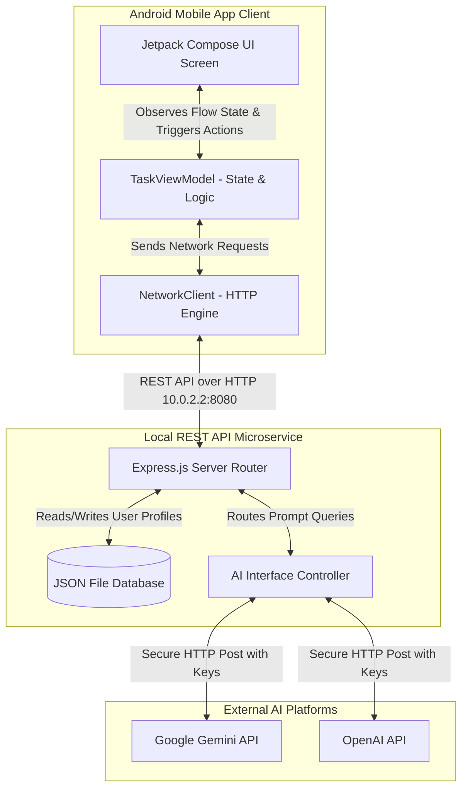
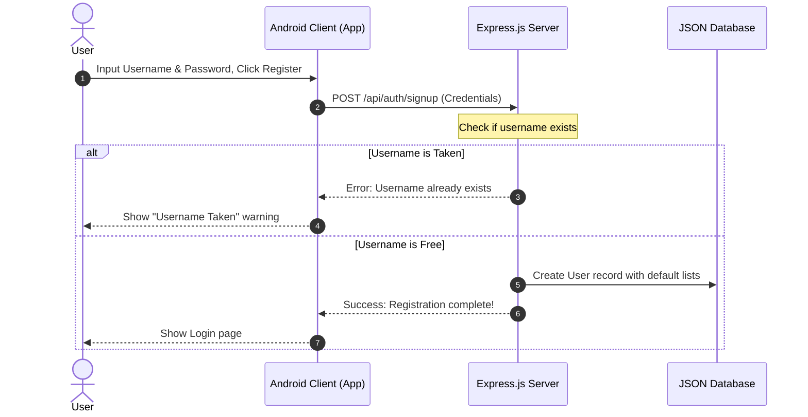
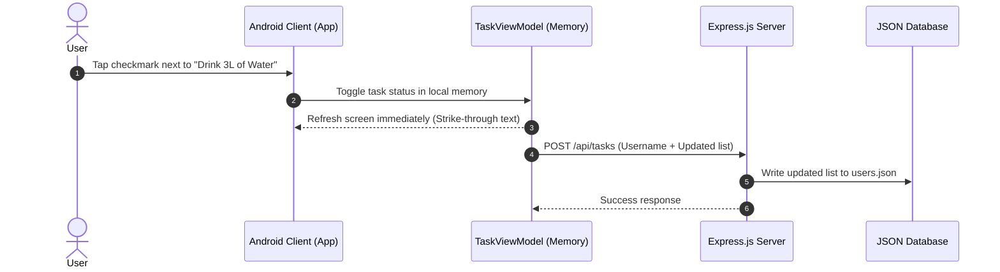
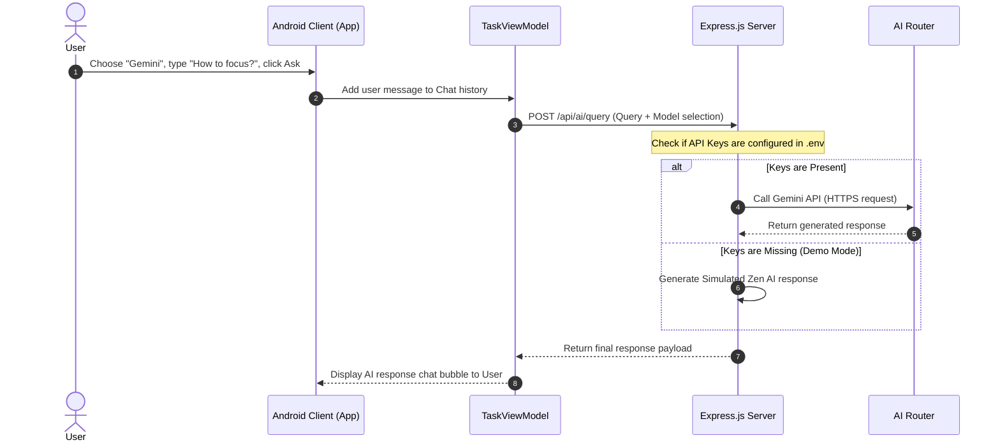
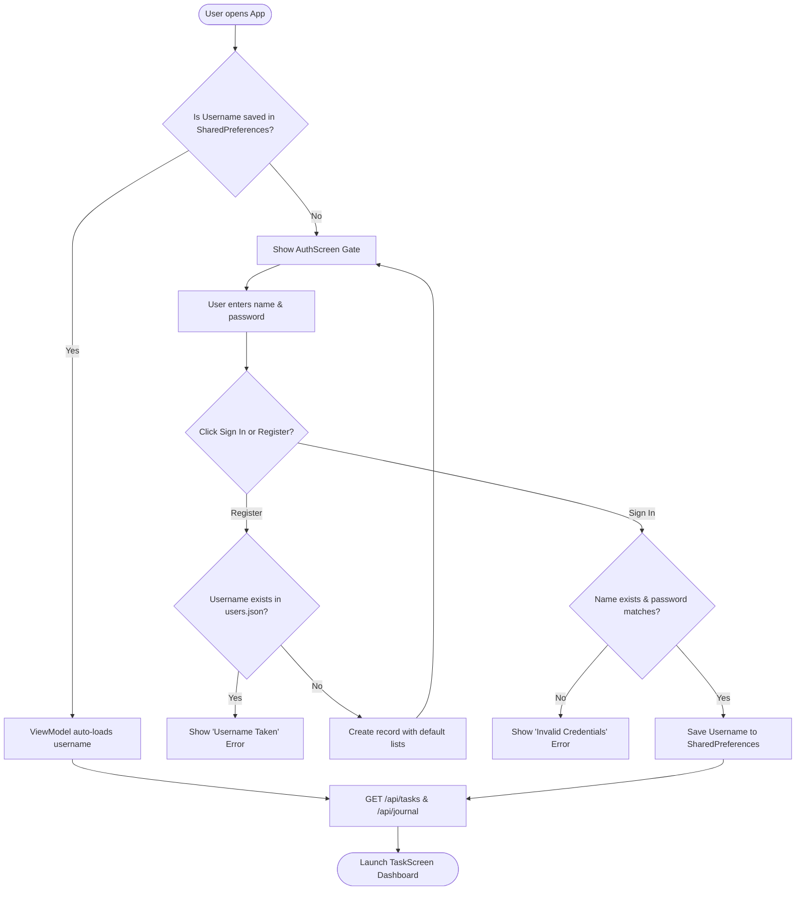
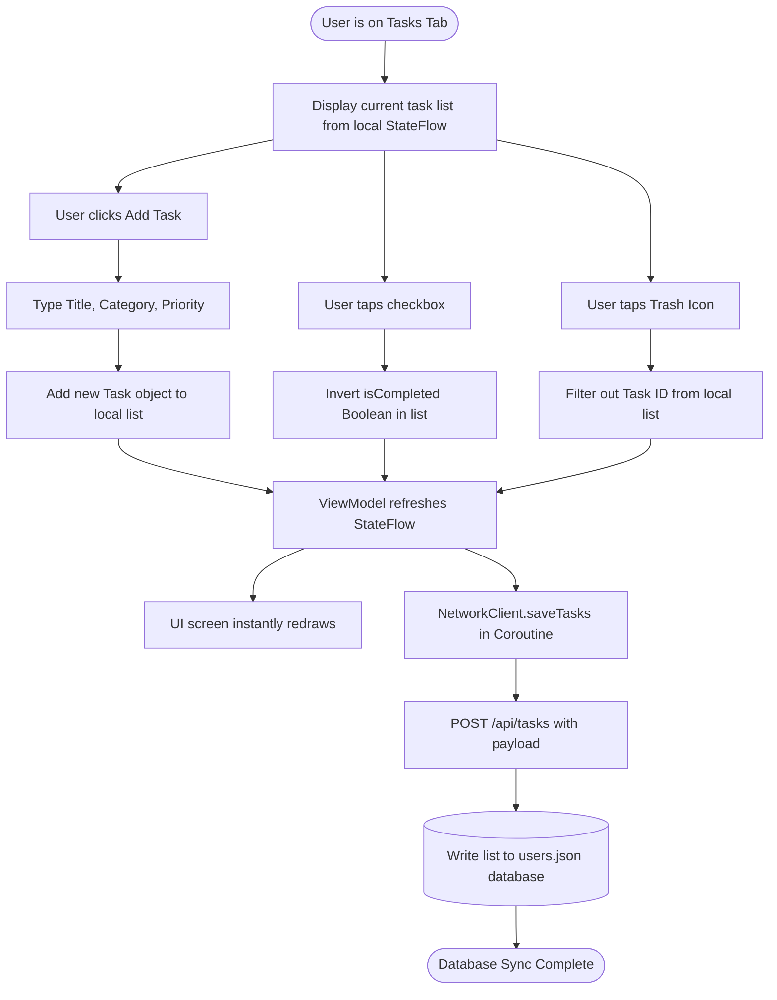
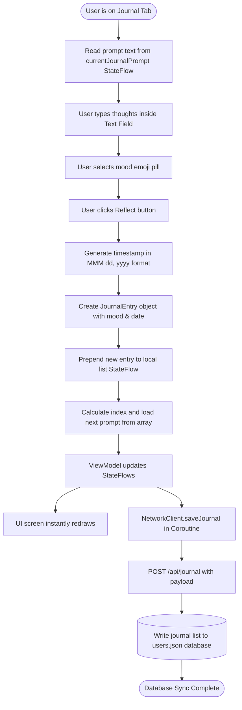
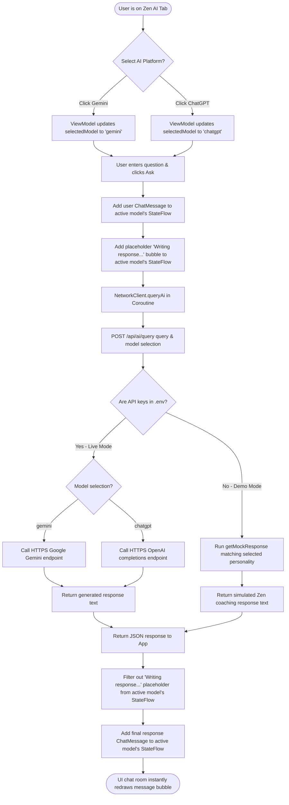

# 📐 MindfulTasks - Architecture, Design Specification & Business Projection

This document serves as the complete technical and business blueprint for the **MindfulTasks V2.0** application. It details the High-Level Design (HLD), Low-Level Design (LLD), user workflows, and system interactions, presenting how the technical backend drives the core business features.

---

## 💼 Part 1: Executive & Business Value Summary

MindfulTasks is a productivity platform designed to reduce stress and increase focus by combining **Task Management**, **Mindful Reflection**, and **Context-Aware AI Coaching** into a single, cohesive interface.

### 1. The Core Business Value Proposition
* **Unified Workspace (Cognitive Load Reduction)**: Traditional productivity models force users to jump between planning apps (like Todoist) and journaling apps (like Day One). MindfulTasks integrates these states, keeping users in a unified flow state.
* **On-Demand Cognitive Alignment**: Integrating Gemini and ChatGPT directly next to user tasks allows for instant, context-aware coaching. Users can ask the AI how to break down complex goals or manage fatigue.
* **Privacy-First Engagement**: By keeping credential verification and API keys on the server, user information is protected, which builds high consumer trust.

---

## 🗺️ Part 2: High-Level Architecture (HLD)

The application uses a **Decoupled Client-Server Model** consisting of an Android native mobile app, a local Node.js microservice, and third-party AI platform layers.



### 1. Architectural Boundaries
* **Client App (Frontend)**: Responsible *only* for rendering the interface, managing temporary screen states (UI states), and handling user interactions. It holds no business keys or database credentials, preventing security leaks.
* **Node.js Microservice (Backend)**: Handles user verification, manages session authentication, performs database reads and writes, and operates as a gateway for external AI systems.
* **AI Router**: An isolated controller within the backend that attaches secret API keys to user messages and requests assistance from Gemini or ChatGPT.

---

## 🔄 Part 3: Functional Workflows (Business Flows)

To project app functionality to business stakeholders, here is how the primary user experiences flow through the system:

### 1. User Registration & Onboarding Flow
Describes the journey of a new user registering an account. The backend automatically populates their profile with default items to ensure a warm onboarding experience.



### 2. Live Task Modification Flow (Checklist sync)
Shows how checking off a task on the screen instantly saves to the backend.



### 3. Zen AI Chat Query Flow
Shows how a user can switch between Google Gemini and OpenAI ChatGPT, and how the backend handles the request (using real API keys if present, or falling back to a Demo response profile).



---

## 🔍 Part 4: Low-Level Architecture (LLD)

### 1. Client Code Structure (Android App)

The app follows the **Model-View-ViewModel (MVVM)** clean architecture pattern.

#### **A. Core Data Classes (Models)**
```kotlin
// Represents a single task item
data class Task(
    val id: String = UUID.randomUUID().toString(),
    val title: String,
    val isCompleted: Boolean = false,
    val priority: Priority = Priority.MEDIUM,
    val category: String = "Life"
)

enum class Priority { LOW, MEDIUM, HIGH }

// Represents a journal reflection log
data class JournalEntry(
    val id: String = UUID.randomUUID().toString(),
    val text: String,
    val date: String,
    val moodEmoji: String
)

// Represents a message in the Zen AI chat log
data class ChatMessage(
    val text: String,
    val isUser: Boolean,
    val timestamp: String
)
```

#### **B. ViewModel States & Operations**
* **Read-Only States (UI Observables)**:
  * `currentUser: StateFlow<String?>` (The active user profile name)
  * `tasks: StateFlow<List<Task>>` (The checklist items)
  * `journalEntries: StateFlow<List<JournalEntry>>` (The reflection records)
  * `geminiMessages: StateFlow<List<ChatMessage>>` (The Gemini conversation log)
  * `chatGptMessages: StateFlow<List<ChatMessage>>` (The ChatGPT conversation log)
  * `selectedAiModel: StateFlow<String>` (Switch selection: "gemini" or "chatgpt")
* **Operations**:
  * `loginSession(username)`: Saves credentials locally in the device's `SharedPreferences` for auto-login and pulls tasks/journals.
  * `logout()`: Clears local session and resets lists.
  * `addTask() / toggleTask() / deleteTask()`: Triggers instant local updates followed by async network sync.
  * `sendAiQuery(text)`: Posts the prompt to the backend and appends responses.

#### **C. Network Service (`NetworkClient.kt`)**
Pipes raw REST request streams over background coroutines (`Dispatchers.IO`) and constructs JSON payloads using Android's native `org.json` package.

---

### 2. Backend Code Structure (Node.js Microservice)

The service acts as the controller mapping HTTP endpoints to actions.

#### **A. API Endpoint Mappings**
* `POST /api/auth/signup`: Registers username and password.
* `POST /api/auth/login`: Verifies user.
* `GET /api/tasks?username=X`: Returns tasks for a user.
* `POST /api/tasks`: Overwrites tasks list.
* `GET /api/journal?username=X`: Returns journal logs.
* `POST /api/journal`: Overwrites journal list.
* `POST /api/ai/query`: Receives query and model parameters and handles OpenAI or Gemini requests.

#### **B. Database File Schema (`users.json`)**
```json
{
  "Anand-D1989": {
    "password": "my_password",
    "tasks": [
      { "id": "uuid-1", "title": "Morning meditation", "isCompleted": true, "priority": "HIGH", "category": "Mind" }
    ],
    "journal": [
      { "id": "uuid-j1", "text": "Excited to code!", "date": "May 26, 2026", "moodEmoji": "🚀" }
    ]
  }
}
```

---

## 📈 Part 5: Enterprise Scaling & Compliance Roadmap

As the app graduates from a prototype to a full production release, the architecture is designed to scale using standard industry upgrades:

```
+------------------+     +-----------------------+     +------------------------+
|   Current Demo   |     |    Mid-Stage Scale    |     |   Enterprise Version   |
| (JSON Database   | ➔  |  (Firebase Auth &     | ➔  | (Docker, AWS ECS, GCP,  |
|  & Local Node)   |     |   PostgreSQL Server)  |     |  PostgreSQL Database)  |
+------------------+     +-----------------------+     +------------------------+
```

### 1. Database Upgrade
* **Current**: Local JSON text file (`users.json`).
* **Production**: Migrate to a relational database (e.g., **PostgreSQL** or **Cloud Firestore**). The CRUD endpoint routes (`/api/tasks`, `/api/journal`) will remain identical, meaning the Android client code won't need to change at all.

### 2. Server Deployment
* **Current**: Runs locally on `localhost:8080`.
* **Production**: Containerize the Express server using **Docker** and deploy it to a cloud provider like **AWS ECS** or **Google Cloud Run**.

### 3. Secure Encryption
* **Current**: Plaintext password verification.
* **Production**: Use **bcrypt** or **argon2** inside `server.js` to hash and salt passwords before storing them. Enable SSL/HTTPS on the server to encrypt all data sent over the network.

---

## 🛠️ Part 6: Deep-Dive Functional Flows & Integration Specifications

This section details the isolated flowcharts, logic gates, and endpoint integration parameters for each of the app's four major features.

---

### Feature 1: User Authentication (Sign In & Register)

This feature gates access to user-specific dashboards. Users register a unique username and password, which the backend stores.

#### **A. Flow Diagram**


#### **B. Integration Parameters**
* **Frontend Components**: `AuthScreen.kt`, `MainActivity.kt`
* **ViewModel Handlers**: `loginSession()`, `checkSavedUser()`
* **API Route Specs**:
  * `POST /api/auth/signup`: Payload `{ "username": "name", "password": "pass" }`
  * `POST /api/auth/login`: Payload `{ "username": "name", "password": "pass" }`
* **Local Storage Updated**: `SharedPreferences` saves key `"username"` on success.

---

### Feature 2: Task Management (Syncing Checklist)

Handles adding, toggling, and deleting tasks. Updates are run locally on the UI instantly and synced to the Node.js server in the background.

#### **A. Flow Diagram**


#### **B. Integration Parameters**
* **Frontend Components**: `TaskScreen.kt` (`TasksTab` & `TaskRow`)
* **ViewModel Handlers**: `addTask()`, `toggleTask()`, `deleteTask()`
* **API Route Specs**:
  * `GET /api/tasks?username=name`: Fetches JSON Array of tasks on login.
  * `POST /api/tasks`: Payload `{ "username": "name", "tasks": [ { "id": "...", "title": "...", "isCompleted": false, "priority": "MEDIUM", "category": "Life" } ] }`
* **Database Action**: Replaces the user's `"tasks"` array inside `users.json`.

---

### Feature 3: Zen Journal (Reflection Log & Prompt Rotation)

Enables daily logging. Every reflection log is date-stamped and mood-tagged. Submitting automatically cycles to the next reflection prompt.

#### **A. Flow Diagram**


#### **B. Integration Parameters**
* **Frontend Components**: `TaskScreen.kt` (`JournalTab` & `JournalRow`)
* **ViewModel Handlers**: `addJournalEntry()`, `rotateJournalPrompt()`
* **API Route Specs**:
  * `GET /api/journal?username=name`: Fetches JSON Array of reflections on login.
  * `POST /api/journal`: Payload `{ "username": "name", "journal": [ { "id": "...", "text": "...", "date": "...", "moodEmoji": "🧘" } ] }`
* **Database Action**: Replaces the user's `"journal"` array inside `users.json`.

---

### Feature 4: Zen AI Assistant (Gemini / ChatGPT Router)

Routes user questions to either Gemini or ChatGPT via selection tabs. Leverages a local microservice proxy to prevent key exposures.

#### **A. Flow Diagram**


#### **B. Integration Parameters**
* **Frontend Components**: `TaskScreen.kt` (`AiTab` & `ChatBubble`)
* **ViewModel Handlers**: `setAiModel()`, `sendAiQuery()`
* **API Route Specs**:
  * `POST /api/ai/query`: Payload `{ "query": "How to stay calm?", "model": "gemini|chatgpt" }`
  * Response `{ "response": "Answer text..." }`
* **External Integrations**:
  * **Gemini (Google)**: `POST https://generativelanguage.googleapis.com/v1beta/models/gemini-1.5-flash:generateContent?key=KEY`
  * **ChatGPT (OpenAI)**: `POST https://api.openai.com/v1/chat/completions` (using `gpt-3.5-turbo`)
